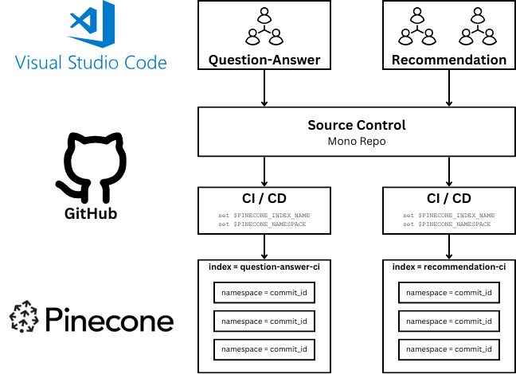
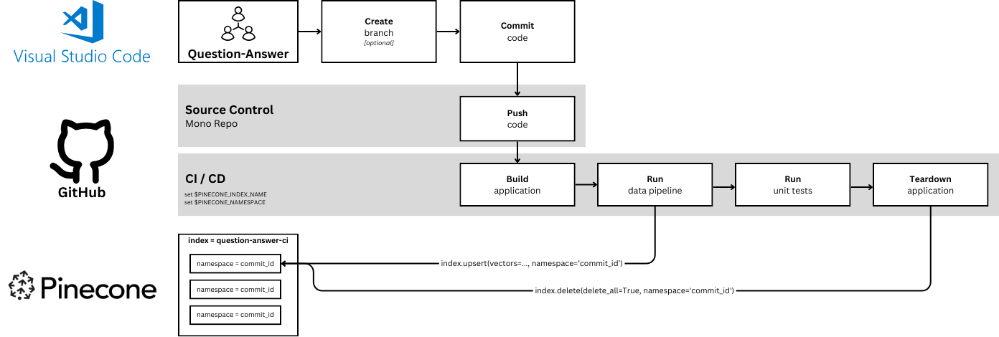
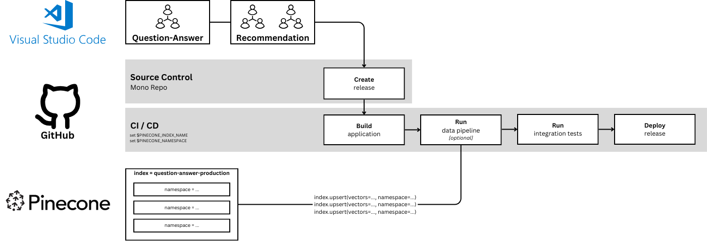
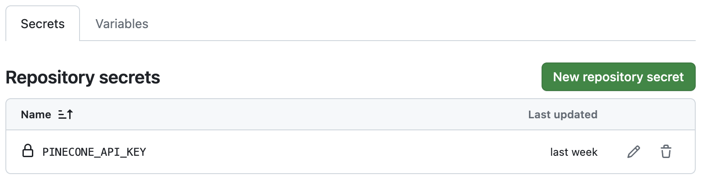
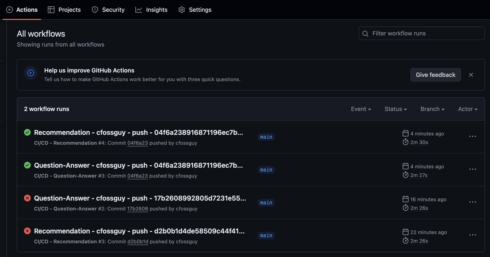
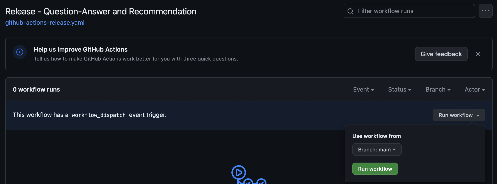

# cicd-demo
This demo attempts to replicate a "mono" repo approach to ci/cd for applications that leverage pinecone. 

## How it Works



Imagine there are multiple development teams that all work in a mono repo. 
Each team has CI/CD that fires when code is committed to the respective repo subdirectory("question_answer" or "recommendation"). The CI/CD job
will set two environment variables to ensure that all unit tests run in a
dedicated "ci" index with a unique "namespace". This ensures that each
job is isolated(runtime and test data). 



When code is committed to the ```question_answer``` sub-folder the 
[CI/CD - Question-Answer](.github/workflows/github-actions-question-answer.yaml) job
executes. When code is committed to the ```recommendation``` sub-folder the
[CI/CD - Recommendation](.github/workflows/github-actions-recommendation.yaml) job
executes. 



In this demo, some elements for a production release are mocked up in 
[Release - Question-Answer and Recommendation](.github/workflows/github-actions-release.yaml). There is a functional data pipeline that just re-runs the pipelines used in our
unit tests. 

## Quickstart
You will need to create a Pinecone account from [Pinecone](https://app.pinecone.io/?sessionType=login) and have an API key that can create three serverless indexes.

### Step #1 - Fork then clone the cicd-demo repo
To fork the repository, follow these steps:

1. Click on the "Fork" button at the top right of this page.
1. If you are part of any GitHub organizations, select the account you want to create the fork in.
1. Wait for GitHub to create the fork. This might take a few seconds.
1. Clone the repo with a command like ```git clone https://github.com/yourusername/cicd-demo.git```

**In order for this workflow to execute, you must set the following secret**



### Step #2 - IDE Setup - Visual Studio Code
Open the repo in Visual Studio and add the following to a ```.env``` file in the project's base directory.

```
PINECONE_API_KEY=[YOUR_API_KEY]
PINECONE_NAMESPACE=[YOUR_USER_ID]
PINECONE_INDEX_RECOMMENDATION=recommendation-ci
PINECONE_INDEX_QUESTION_ANSWER=question-answer-ci
```

Open a terminal window and create a python virtual environment and install packages required for demo.

```
python3 -m venv .venv
source .venv/bin/activate
pip install -r requirements.txt
```

Run ```python setup.py create``` to create the following indexes:
1. question-answer-ci
1. question-answer-production
1. recommendation-ci
1. recommendation-production

These indexes are NOT ephemeral. Pinecone namespaces will allow us to re-use a single index for multiple, simultanenous 
commits.

### Step #3 - Local Test
The following commands can be run in a terminal window to make sure that the unit tests
function properly.

#### Question-Answer
```
python question_answer/data_pipeline.py upsert
python -m unittest question_answer.test
python question_answer/data_pipeline.py delete
```

#### Recommendation
```
python recommendation/data_pipeline.py upsert
python -m unittest recommendation.test
python recommendation/data_pipeline.py delete
```

### Step #3 - CI/CD Test
You can uncomment code to introduce a failing test and code fix. If you don't want to wait
for GitHub Actions, you can re-run the unit tests locally.

#### Question-Answer
1. Uncomment lines 14-17 in [./question_answer/test.py](./question_answer/test.py) and commit+push the change
to github. The unit tests will fail.
1. Uncomment lines 35-36 in [./question_answer/query.py](./question_answer/query.py) and commit+push the change
to github. The unit tests should pass.

#### Recommendation
1. Uncomment lines 14-18 in [./recommendation/test.py](./recommendation/test.py) and commit+push the change
to github. The unit tests will fail.
1. Uncomment lines 37-38 in [./recommendation/query.py](./recommendation/query.py) and commit+push the change
to github. The unit tests should pass.



Your Github actions tab should have four jobs(two failing jobs and two successful jobs)

### Step #4 - "Production" API Service 
Production is in quotes because we really don't have a production service. There is a 
[Release - Question-Answer and Recommendation](.github/workflows/github-actions-release.yaml) job
that runs the data pipeline for the ```Question-Answer``` and ```Recommendation```. 



This job must be run manually. 

And, there is a [FastAPI](./main.py) service that can be run locally to mock production.

To test both services in "production" you will need to add the following variables
to the ```.env``` file

```
PINECONE_INDEX_RECOMMENDATION=recommendation-production
PINECONE_INDEX_QUESTION-ANSWER=question-answer-production
PINECONE_NAMESPACE=
```

Then, start the API service, via this command:

```
uvicorn main:app --reload
```

Open a browser and go to http://localhost:8000/docs. 

### Step #5 - Teardown Indexes
To teardown the indexes, run the following command.

```
python setup.py delete
```


